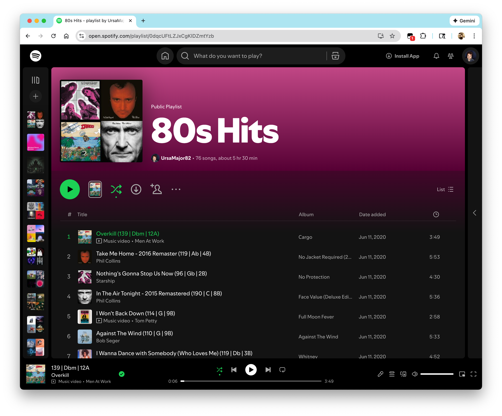
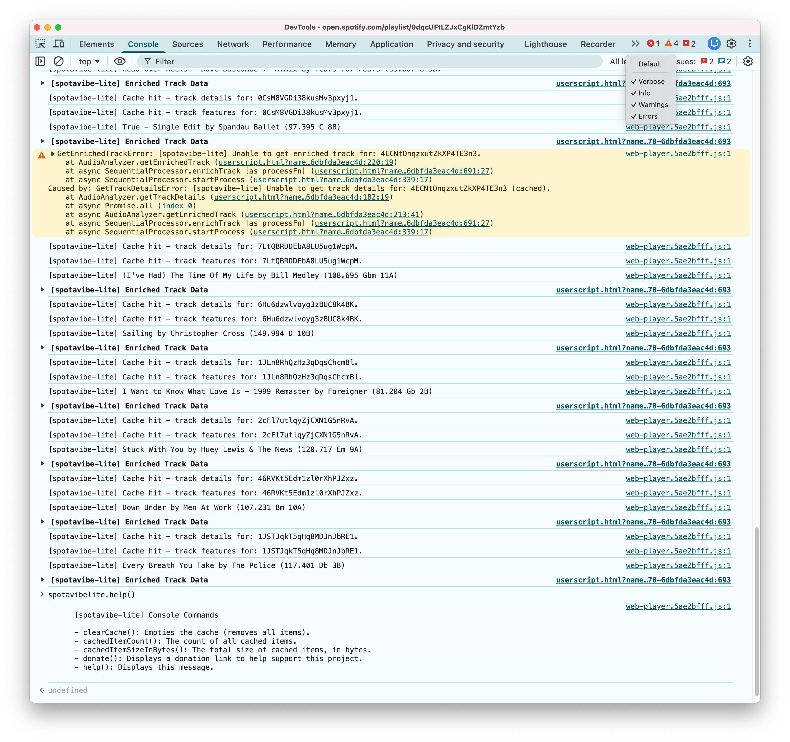

# SpotAVibe Lite

A [Userscript](https://share.google/aimode/9SnOg0rhvgdQ2t5O2) that overlays basic DJ information (bpm, key, [camelot notation](https://share.google/aimode/WjqrbjUpvlXZJAJKl), etc) on the Spotify web player.

## Donations

Want to support this project? Use the following link:

https://www.paypal.com/ncp/payment/EZHV3YMSZFQ4G

## Usage

### Prerequisites

- [Spotify](https://open.spotify.com/) account, free or premium
- [Tampermonkey](https://www.tampermonkey.net/) (or similar userscript manager)

### Installation

Click the link (or copy/paste) and follow your userscript manager's instructions:

https://github.com/NBS-LLC/spotavibe-lite/releases/latest/download/spotavibe-lite.user.js

### Guide

Once the usesrscript is installed and activated, refresh Spotify's web player.

If a song's audio features can be located they will be displayed next to the song's title:



### Advanced

Audio features, debug information and console commands can be found via the browser's dev tools:



## Development

### Prerequisites

- Installation prerequisites
- [ASDF](https://asdf-vm.com)

### Build

```bash
> asdf install
> npm install
> npm run package:userscript
```

### Run

After building, run it locally:

```bash
> npm run serve:userscript
```

This will launch a local http server, host the userscript and open your default browser for installation.

Once installed the http server can be stopped (ctrl+c).
